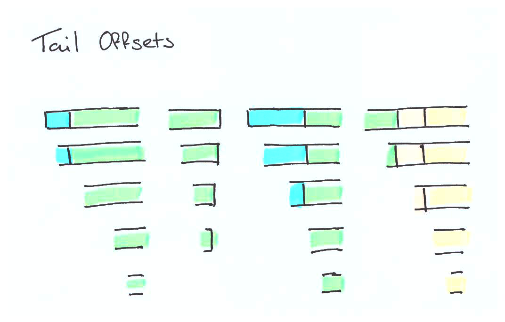
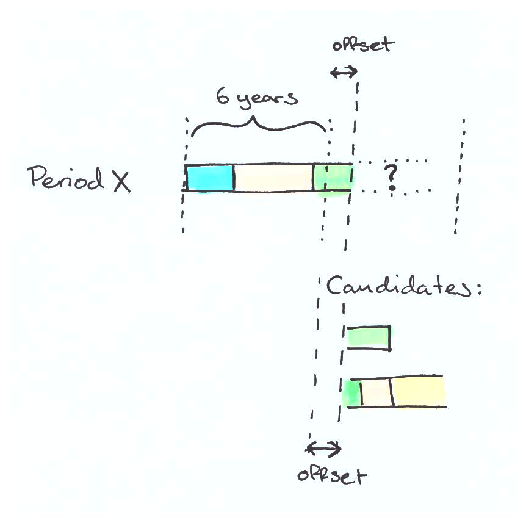

# Placement & duration modelling

## Context

When closing open cases and projecting future cases in the model, we must have a way of assigning a plausible placement to each case at each point in time. The placements and the transitions between them should exhibit similar characteristics to those that have been observed historically according to the projected child's age and case history. Several strategies have been attempted to meet this requirement, most of which have involved creating future pathways as a composite of shorter building blocks sampled from the historic data. These methods have tended not to model total durations in care very well. The probability of a child leaving care is based on factors including their current age, their placement, and their prior duration in care. This final factor is particularly difficult to model because it's non-linear: for most ages the probability of leaving is bimodal, with one mode falling within the first few years, and the second peak occuring prior to the 18th birthday with only a small probability of leaving in between. The number of projected children in care is extremely sensitive to the child's duration in care because small differences in the average duration apply to all current and future children, resulting in something like a compound effect.

Another source of complexity arises from the fact that the target duration distribution can't be measured directly from the input data because the method of data collection introduces bias. The only durations we know for sure are the durations of closed cases, but closed cases are heavily skewed shorter. Longer durations in care are more likely to be open cases, but we don't yet know how long they're going to be when they eventually close. We therefore require a principled means of _estimating_ the long-run duration distribution of all case from the closed cases and the duration of currently-open cases. A technique called survival analysis offers this, and it outputs the distribution quantiles of our target distribution.

These observations led to a realisation that a) duration modelling must be as precise as possible, because small differences have disproportionate effects on total children in care b) the target duration should be inferred by survival analysis rather than measured directly from the data c) duration, age and placement pathway ought to be modelled together because they are inextricably linked.

## Decision

The decision has been taken to make use of a generative process to create plausible pathways for children in care by chaining together 6-year pathway sections sampled from the historic data. Having created many plausible placement pathways of varying durations, rejection sampling is used to balance the resulting duration distribution so that it matches the distribution inferred by survival analysis.

**Generate candidates**

The requirement to constrain sampled durations to match a target distribution is made easier if the candidate distribution is known ahead of time. Primarily for this reason, we implement a 'pre-step' to the model in `cic.repl/generate-candidates!` which outputs a CSV containing many hundreds of thousands of re-sampled period sequences. These candidates form the universe of possible variation of placement sequences and durations, but without constraining durations except to ensure children don't leave beyond their 18th birthday. Since they represent a finite set, we can more easily implement the necessary adjustments to selectively balance for our desired target duration distribution later on.

Since the model needs to close open cases (as well as generate brand-new projected cases), we must make sure that the `generate-candidates!` step knows when our projection starts because this determines which cases are open at that point in time. This date may not be the day after the data was extracted, since it's valuable to 'back-cast' the projection from earlier points in time for cross-validation. As a result, the generate candidates output is specific to a particular projection start date, and can't be re-used if a different projection start date is subsequently desired: the `generate-candidates!` step must be run again with the new projection start date.

The generated candidates are composed of 5 different record types:
- H records: historically closed cases. We sample probable birthdays for each of these using the birth month as a key constraint, but also the date of entry (so joiners can't be less than zero) and the leave date (so that leavers can't be over 18).
- O records: historically open cases. We sample probable birthdays for these as above but using the extract date instead of leave date (since none yet exists).
- C records: candidate periods. These are the open periods with resampled birthdays, and we create multiple birthdays for each candidate by resampling n times, specified by the `:candidate-variations` config variable.
- P records consisting of:
  - a) C records which are completed according to the baseline period completer algorithm (described below).
  - b) C records which are completed according to the 'age out' period completer algorithm.
- S records consisting of:
  - a) C records which are truncated to an arbitrary point in their past and then completed with the baseline period completer algorithm.
  - b) C records which are truncated to an arbitrary point in their past and then completed with the 'age out' period completer algorithm.

**The period completer algorithm**

The period completer algorithm is the core process by which novel periods are generated. Its job is twofold: to decompose periods from the historic data into segments which can be reassembled like building blocks to form new periods, and thereafter to use those building blocks to complete open cases. This process is followed regardless of whether we're seeking to close an open case (P records) or generate an imagined new case (S records). S records are the result of truncating a closed case at some point in its history and then imagining a way that it might have been completed instead. The entrypoint to this algorithm is `cic.model/markov-placements-model`.

*Splitting periods into segments*

Each period is split into consecutive segments of 6 years. For closed cases, the partial segment at the end is retained and marked as a terminal segment. For open cases, the final segment at the end is discarded. If segments start occur within the training range (specified as n years before projection start), they're marked as `:in-filter?`. This capability allows for the possibility of filtering candidate segments to within a particular date range, although this functionality is not currently used.

The constraint that all segments except terminal segments are sourced by segmenting existing periods into sequential 6-year chunks implies a potential issue completing open cases which aren't close to a 6-year boundary. For example: would an open case currently 3 years long match to segments starting after 0 or 6 years? Or would an open case of 9 years match to segments starting after 6 or 12 years? In each case neither seems appropriate. Since in general we will not generate good placement sequences splicing open segments with a crude grain of 6 years, we implement an 'offset' algorithm for splicing segments other than at a 6-year boundary. This algorithm starts by calculating the offset through the latest 6-year window of the end of the open case. For example, for 9 years this might be 3 * 365 = 1095 days, because the 9th year has a 3 year offset into the second segment. We create offset versions of all segments: the tail portion after dropping the first n days. In order to complete the matching efficiently, we pre-calculate all offset versions of all segments in advance. An offset version of a terminal segment is still a terminal segment.

*Completing open cases*

Completing an open case proceeds in a loop, matching a 6 year segment (or an offset equivalent), until we reach a terminal segment or exceed 18 years of age, at which point the loop terminates.

Matching uses a combination of exact and fuzzy matching in `cic.model/markov-period`. Exact matching of certain fields ensures that segments being chained are compatible, whereas fuzzy matching ensures that the algorithm is non-deterministic and introduces useful variety into the generated ccandidates. Fields which are matched exactly are the placement at the join, the offset (measured in days) from a round 6 years and whether or not a 'terminal segment' is desired. Fuzzy matches are the join age in days and the number of days in care. Fuzzy matching is implemented by adding noise to the match values and then finding the closest matching segment using the Euclidean distance in `cic.model/get-matched-segment`. Because match values of join age and days in care have well-defined min and max values (0 days and the durations corresponding to the 18th birthday respectively), binomial (instead of guassian) noise is added using `cic.model/jitter-binomial`. The binomial distribution of noise has several useful properties: it ensures that values are constrained within the min and max whilst remaining balanced around the mean, has smaller variance at the extremes (close to zero and 18 years old) where timings are more sensitive, and increased variance in the middle of the range where timings are much less sensitive.

Since exact matching may sometimes yield no results, we have a fallback process which aims to find the most restrictive exact match first, and tries successfully less strict matches if none are found. If we're looking for an age-out candidate then we check to see whether this match will take us to within 3 months of the 18th birthday. If yes, make it a terminal segment, else make sure it's not. This is because we want to end with terminal segments at the end of placement pathways, rather than just truncating segments. Otherwise, we try to find a match with the same offset sharing the same placement. If this yields no matches, we search just for candidates with the same last placement.

Having found a candidate match, we then need to take our match and combine it with the head of the placement sequence. This will extend the existing placement sequence by exactly the length of the matched segment (6 years, or less for an offset segment or one which takes the child past 18 years of age). We need to decide if we are going to loop further. If we have a terminal segment or if the child has exceeded 18 years of age then we stop.

If we don't stop, then the loop continues with the extended placement sequence created by adding this segment to previous head of the placement sequence as the new sequence to be matched.

**Rejection sampling**

The process described above is designed to create a large number of placement pathways which are similar to those observed historically but are nonetheless different in terms of the exact age at which children join, the exact age at which they leave, and the exact duration of the placement sequence. Novel placement sequences can be created, but only by chaining 6-year subsections (with initial shorter offset segments) together. This clearly constrains the amount of novel placement sequences which can be created. However, there are lots of subtly different lengths created. This is important, because it's what allows rejection sampling to work.

Rejection sampling is a process of making one distribution like another through selective resampling. For example, if I have a bag of 10 blue and 5 red marbles but I want to sample (with replacement) a uniform distribution of blue and red I can employ rejection sampling after each sample. Every time I draw a blue marble from the bag I sample a random number between 0 and 1. If the number is greater than 10/5, or 0.5 (the rejection threshold), I log a blue sample and return the marble. If it's less than 0.5 I return the marble without logging the sample and repeat the process. For red marbles the rejection threshold is 0. If I repeat this process lots of times, the accepted samples will show a distribution equivalent to if I had an even number of blue and red marbles in the bag: a uniform distribution. Careful calibration of the rejection thresholds (0.5 and 0 in this example) for each sampled value can theoretically turn any proposal distribution into any other target distribution, provided the proposal distribution has some probability density everywhere the target distribution has probability density. This is because rejection sampling can only reject proposed samples, it can't create samples if they're not generated in the first place. This is equivalent to saying that we can't create a uniform red-blue-green marble distribution if there aren't any green marbles in the bag. Here's a [detailed technical explanation of rejection sampling](https://bookdown.org/rdpeng/advstatcomp/rejection-sampling.html) including how to calculate the rejection threshold, and there's [a more visual explanation here](https://towardsdatascience.com/what-is-rejection-sampling-1f6aff92330d).

**Survival analysis**

The target distribution is a distribution we infer using survival analysis. This is because the distribution of closed case durations is biased in favour of shorter cases due to the way the data is sourced. Long cases are more likely still to be open, and we don't know for sure how long they will eventually be. Survival analysis adjusts for this by attempting to infer the long-run distribution of durations taking duration of closed and currently-open cases into account. The result of survival analysis gives us the target duration distribution which we represent by 10,000 quantiles, which provides sufficient granularity to estimate the probability of a child leaving for each week of their time in care. In fact we generate 18 target distributions - one for each join age - and pick the one corresponding to the age the child entered care.

Although survival analysis provides the necessary framework to estimate duration in care up to 18, it doesn't provide for a hard cap at 18 years of age. The survival model assumes one of two things: if the longest case in the training data is a closed case, then the duration of this case is the theoretical maximum duration whereas if the longest case in the training data is an open case, then the maximum duration is unknown. Of course, neither of these assumptions fit our domain: we know that the maximum duration in care is the length of time between the child's join age and their 18th birthday. Faceting the survival model by age in years doesn't solve this fundamental problem: some age zero joiners can remain in care for a full 18 years if they join on their date of birth, other age zero joiners who join just before their 1st birthday can remain in care for a maximum of just over 17 years, almost a year less. The ideal solution would be a model which returns a dedicated survival probability for a child based on the exact age in days they entered care, but this isn't possible using standard survival analysis. If we were to facet the model by age in days then we would have very few examples to work from for each age and lots of gaps in between.

**Age out model**

To go some way towards mitigating this problem we make a simplifying assumption: all children who leave care after the age of 17 _actually_ leave care on their 18th birthday. This sounds like a gross oversimplification, but in fact most children who leave care aged 17 do leave on their 18th birthday (at least for the LAs we have studied so far). This is a useful assumption because it allows us to break the problem into two steps: what's the probability child x will stay in care until after the age of 17, and (if they don't) what will their duration in care be? If child x remains in care until after 17, then we know what their duration in care will be: it'll be whatever takes them up to their 18th birthday. If they don't, then we can use survival analysis to determine their duration in care for durations up to their 17th birthday. 

Supporting this extra model requires an additional model input: the probability of exceeding 17 years of age in care by admission age. This is close to 0 for zero-age joiners, and exactly 1 for age 17 joiners. It's contained in the file `age-out-proportions.csv`.

**Candidates files**

Generate candidates process outputs 4 files: `simulated-candidates.csv`, `projected-candidates.csv`, `projected-age-out-candidates.csv`, `simulated-age-out-candidates.csv`.

The `simulated-*` candidates files are organised by admission age and are used for generating new joiners, the `projected-*` files are indexed by period id and are used for closing open cases.
The `*-age-out-candidates` files contain the results of attempting to generate closed cases which persist until 18, whereas the other files will generally not contain age out candidates. This is not _always_ the case: we will have been unable to generate projected-age-out candidates for some children (if there is nothing in the source data which allows us to chain a sequence which ends at 18 for that child). Likewise there will be age 17 joiners in the non-age-out files who age out by definition.

**Projection**

Each model projection run needs to do two things: close the currently open cases, and generate new joiners with full placement pathways.

Closing currently-open cases is handled by `cic.periods/close-open-periods`. The `projected-*` candidate files will already contain all of the ways in which each case can be closed available to the model. We run the age out model to determine whether we are seeking an age out completion of not for this period. As previously mentioned, we may not always be able to find an age out case if one is sought, or a non-age-out case if one is not sought. A potential future enhancement to the model would be to adjust the relative probability of aging out according to whether we had been able to satisfy the age out requirements so far, to ensure that practical constraints such as these don't adversely impact on the accuracy of the sampling.

Simulating novel cases is handled as part of the joiners process `cic.projection/joiners-seq`. Each joiner's placement sequence, duration and admission age (in precise days) is generated by the simulation model passed to that function. We also call the age out model to determine the probability that a child will age out. If they do age out, `cic.model/age-out-simulation-model` is called, which selects a random age out candidate from the pool. If they don't age out, `cic.model/simulation-model` is called. This model makes use of the rejection sampling probabilities to sample a random candidate with the correct age whilst also preserving the distribution of durations in care.

## Status

Accepted.

## Consequences

Since the model needs to close open cases (as well as generate brand-new projected cases), we must make sure that the generate-candidates step knows when our projection is to start from. The generate candidates output is specific to a particular projection start date, and can't be re-used if a different projection start date is subsequently desired.

The generate candidates process doesn't use a seed and is not deterministic. The model is deterministic because it can re-use the same candidates input files.

Survival analysis and rejection sampling are faceted by join age with no pooling of information from surrounding ages. If no joiners are observed for a partiular age in the source data, we will be unable to generate any joiners of that age in the model.

The current approach to aging out and survival analysis is imperfect. Some candidates we didn't intend to age out will stay until 18 and become defacto age-out candidates, and contrariwise some candidates we would like to age out simply can't be because of practical constraints within the period-completer algorithm.

Rejection sampling is based solely on the duration in care. The model doesn't monitor what placement sequences are created: it is possible that rejection sampling will cause bias to be introduced into other aspects of the period output by systematically under or over-representing placement sequences which are correlated with duration.
